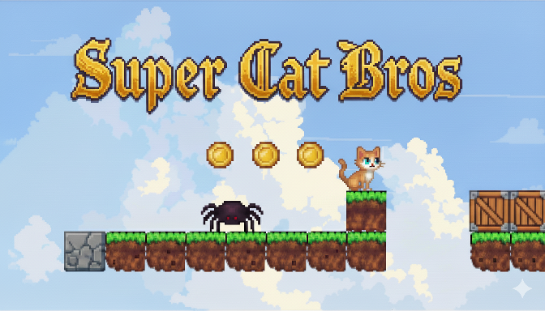

# Welcome to the Gfx-Engine Wiki!

Welcome to the Gfx-Engine wiki! Wikis provide a place in your repository to lay out the roadmap of your project, show the current status, and document software better, together.

***

## Quick Links
*   [Getting Started](#getting-started) (Coming Soon)
*   [Engine Architecture](#engine-architecture) (Coming Soon)
*   [Project Roadmap](httpss://github.com/AndroidCoders/Gfx-Engine/blob/master/docs/Tasks.md)



***

## Project Overview

Gfx-Engine is a modular 2D game engine written in Rust, designed for creating pixel-art platformers. The project's goal is to provide a solid foundation for building classic 16-bit era inspired games with modern development practices.

The engine is built with a focus on a data-driven architecture, allowing developers to configure many aspects of the game, from entity properties to level layouts, through simple TOML files.

### Key Features

*   **Modern Tech Stack:** Built with Rust and SDL3 for performance and safety.
*   **Data-Driven Design:** Easily configure game elements using TOML files.
*   **ECS Architecture:** A flexible and scalable Entity-Component-System design.
*   **Physics Engine:** A robust physics engine for platforming mechanics.
*   **Animation System:** A state-machine-driven animation system for fluid character animations.

### "Super Cat Bros" Demo

The project includes a playable "Super Cat Bros" demo game that showcases the engine's capabilities. This demo serves as both a demonstration of the engine and a driver for its development.

***

## Getting Started

This section will guide you through setting up and running the Gfx-Engine project.

### Prerequisites

To build and run Gfx-Engine, you will need:
*   **Rust:** Install Rust and Cargo (Rust's package manager) by following the instructions on the [official Rust website](https://www.rust-lang.org/tools/install).

### How to Run

Once you have Rust and Cargo installed, you can build and run the "Super Cat Bros" demo game:

1.  Clone the repository:
    ```bash
    git clone https://github.com/AndroidCoders/Gfx-Engine.git
    ```
2.  Navigate to the project directory:
    ```bash
    cd Gfx-Engine
    ```
3.  Run the demo:
    ```bash
    cargo run
    ```

### Configuration

The engine's behavior is controlled by several TOML configuration files:

*   `config.toml`: Contains core engine settings such as window dimensions, fullscreen mode, VSync, and global physics parameters like gravity and maximum speeds.
*   `assets/game_config.toml`: Defines game-specific settings, including player properties (start position, dimensions, animation details), world boundaries, and configurations for enemies, collectibles, and audio.
*   `assets/levels/`: This directory holds individual level layout files, typically in TMX format, which define the tile maps and entity placements for each game level.

***

## Engine Architecture

Gfx-Engine is built with a modular and data-driven architecture to ensure flexibility, performance, and ease of development.

### Entity-Component-System (ECS)

The core of the engine's design is an Entity-Component-System (ECS) pattern. This architectural pattern promotes a clear separation of concerns:

*   **Entities:** Simple identifiers representing game objects (e.g., player, enemy, coin).
*   **Components:** Raw data attached to entities, defining their properties (e.g., `Position`, `Velocity`, `Sprite`).
*   **Systems:** Logic that operates on entities that possess specific components (e.g., a `PhysicsSystem` might update `Position` based on `Velocity`).

This design makes it easy to add new features and behaviors without modifying existing code, leading to a highly scalable and maintainable codebase.

### Data-Driven Design

Almost all aspects of the game, from character animations to level layouts and physics constants, are loaded from external TOML configuration files. This approach allows for rapid iteration and easy modification of game parameters without recompiling the engine.

### State Machines

The engine utilizes state machines, particularly for character animations and AI. This allows for clear and manageable transitions between different behaviors (e.g., `Idle`, `Walking`, `Jumping` for a player character).

### Rendering Pipeline

The `src/renderer.rs` module is responsible for all drawing operations, efficiently rendering game assets to the screen. It works in conjunction with the `TextureManager` to handle sprite sheets and textures.

### Physics and Collision

The `src/physics.rs` module handles generic physics and collision detection logic, ensuring realistic interactions between game entities and the environment.

***

## Development & Contribution

We welcome contributions to Gfx-Engine! Here's how you can get involved:

### Workflow

We follow a standard Git workflow:
*   All work is done on feature branches (e.g., `feature/my-new-feature`).
*   Commit messages adhere to the [Conventional Commits](https://www.conventionalcommits.org/en/v1.0.0/) specification.
*   Pull requests are used to merge changes into the `master` branch.
For more details, please refer to `docs/Workflow.md`.

### Coding Style

To maintain consistency and readability, all code should:
*   Be formatted with `rustfmt`.
*   Adhere to `clippy` suggestions.
*   Follow the design principles and conventions outlined in `docs/CodingStyle.md`.

### Project Roadmap

The project's development is guided by a detailed roadmap, which you can find in `docs/Tasks.md`. This document outlines all planned features, improvements, and bug fixes, organized into prioritized phases. We are currently in **Phase 3: "Super Cat Bros" Demo - Gameplay Polish**.
